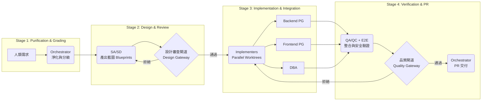

# multi-agent-dev-team

> 以多智能體協作驅動企業級軟體開發的自主化治理框架

本專案是一個基於 Karpathy 智能體原則構建的實驗性框架，旨在透過分工明確、模型分層的 AI Agent 團隊，實現從「模糊需求」到「高品質 PR」的全自動化開發流程。我們不僅追求編碼效率，更強調設計藍圖 (Blueprints) 的嚴謹性與安全開發生命週期 (SSDLC) 的深度整合。

---

## 🤖 Agent 團隊構成

團隊採用分層模型策略：高階決策與設計使用 **Claude 3 Opus** 以確保邏輯完整性；執行層則使用 **Claude 3.5 Sonnet** 以追求編碼速度與準確度。

| Agent | 職責描述 | 能寫碼 | 模型 |
| :--- | :--- | :---: | :---: |
| **Orchestrator** | 需求淨化、任務路由、狀態掌控、PR 協調 | ✗ | Opus |
| **SA/SD** | 架構設計、BDD User Stories、規格藍圖 (Blueprints) | ✗ | Opus |
| **Backend PG** | Controller, CQRS Handler, Domain, Infrastructure | ✓ | Sonnet |
| **Frontend PG** | Vue 3 Components, Routing, API Client Integration | ✓ | Sonnet |
| **DBA** | Schema Design, Migrations, Indexing Strategy | ✓ | Sonnet |
| **QA/QC** | 系統整合驗證、安全性審查、批判性迴圈 (Critique) | ✗ | Opus |
| **E2E Test** | Playwright 端到端核心業務流程驗證 | ✓ | Sonnet |

---

## 🔄 四階段協作工作流

開發流程嚴格遵循「設計驅動開發」原則，透過明確的設計藍圖與審查閘道 (Gateways) 確保品質。



---

## 🛡️ 安全文化 (SSDLC)

本框架深度整合 **NIST SSDF** 安全開發標準。所有產出的程式碼與設計必須通過以下五大安全標籤 (Security Labels) 的檢核，以建立企業級的安全防禦：

*   🔐 **Auth**: 強制身份驗證與權限控管 (Identity & Access Management)。
*   👁️‍🗨️ **Sensitive Data**: 確保個人資安與敏感資料的加密與保護。
*   📥 **External Input**: 嚴格執行輸入驗證，防止注入攻擊 (Injection Prevention)。
*   ⚠️ **Irreversible Action**: 對於金流、刪除等不可逆操作需具備防禦機制。
*   🤖 **AI-LLM**: 防禦提示詞注入與確保模型輸出之安全性與合規性。

---

## 📂 快速導航

| 文件類型 | 路徑 | 說明 |
| :--- | :--- | :--- |
| **協作規範** | [`AGENTS.md`](.github/AGENTS.md) | 團隊治理、路由規則與退回機制 SSOT |
| **技術藍圖** | [`docs/specs/`](docs/specs/) | SA/SD 產出的規格設計文件 (Blueprints) |
| **品質報告** | [`docs/code-review-report.md`](docs/code-review-report.md) · [`docs/verification-report.md`](docs/verification-report.md) | QA/QC 的安全性與整合驗證結果 |
| **架構決策** | [`docs/specs/adr/`](docs/specs/adr/) | 架構決策紀錄 (Architecture Decision Records) |
| **安全基準** | [Security Baseline](.github/skills/security-baseline/) | SSDLC 實作標準與技能庫 |

---

## 📂 Repo 結構

```text
multi-agent-dev-team/
├── VeggieAlly/          # 產品專案實作 (Product Implementation)
├── docs/
│   ├── specs/           # 技術規格藍圖 (SA/SD Blueprints)
│   │   └── adr/         # 架構決策紀錄 (ADR)
│   ├── code-review-report.md   # 程式碼審查報告
│   └── verification-report.md  # 整合驗證報告
├── scripts/             # 自動化維運與管理腳本
└── .github/
    ├── AGENTS.md        # 團隊協作與治理規範
    ├── agents/          # Agent 定義檔與配置
    ├── skills/          # 安全基準與共用技能庫 (SSDLC)
    └── ISSUE_TEMPLATE/  # 標準化需求與任務模板
```

---

## 🚀 專案展示

*   **[VeggieAlly](./VeggieAlly/)**: 本框架的標準驗證案例。一個為蔬菜批發商設計的 LINE 智能助理，包含 AI 菜單生成、庫存管理與 LIFF 銷售端，完整展現了從需求到生產環境級別的開發流程。

---

## ⚖️ 授權
MIT
