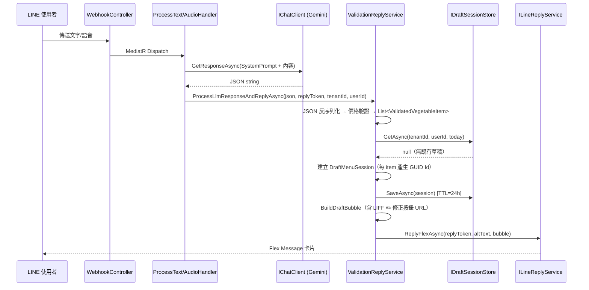
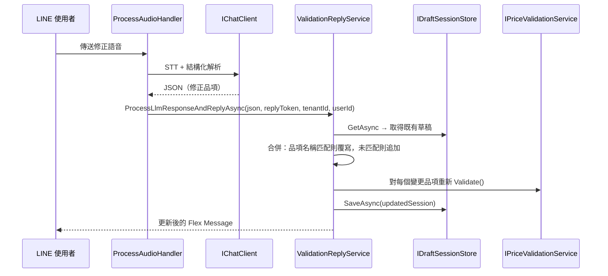
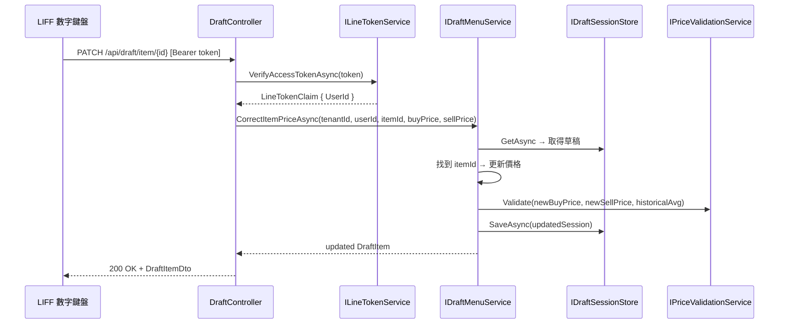

# P3-001: Redis 草稿管理 + 雙軌修正 API — SA/SD 規格藍圖

## 文件資訊

| 項目 | 值 |
|------|---|
| Phase | 3 |
| 上游輸入 | `docs/菜商神隊友_PRD_v2_開發技術版.md` §3.2–§3.3 |
| 前置完成 | P2-001（價格驗證）、P2-002（Flex Message）、P2-003（語音 STT） |
| 下游消費者 | 後端 PG、前端 PG（LIFF） |
| 狀態 | Draft |

---

## 1. 系統邊界定義

- **前端職責**（P3-001 不實作，僅定義介面契約）：LIFF 數字鍵盤網頁接收 querystring `?item_id={id}&field={buy_price|sell_price}`，送出 PATCH 請求。
- **後端職責**：草稿 Session 生命週期管理（建立 / 讀取 / 合併 / 更新）；語音覆寫修正（Audio → 取草稿 → 重新解析 → 合併 → 重新驗證 → 回覆）；PATCH API 端點；LIFF Access Token 驗證；Tenant 隔離。
- **資料層職責**：Redis 暫存草稿（24h TTL）；In-Memory fallback（MVP 無 Redis 可用時）。

---

## 2. 架構決策紀錄

### ADR-001: 草稿儲存抽象選型

**決策**：自定義 `IDraftSessionStore` 介面，不使用 `IDistributedCache`。

**理由**：`IDistributedCache` 僅提供 `byte[] Get/Set`，語義層次太低。自定義介面可精確表達 `GetAsync(tenantId, lineUserId, date)` / `SaveAsync(session)` 語義，實作內部自行處理 JSON 序列化與 Key 組裝。兩個實作類各約 40 行，維護負擔可忽略。

### ADR-002: Redis 套件選型

**決策**：使用 `StackExchange.Redis` >= 2.8.0。

**理由**：.NET 生態系事實標準，ASP.NET Core 原生支援。透過 `IConnectionMultiplexer` 直接操作 String 類型 Key。不引入額外 ORM-like 層。

### ADR-003: In-Memory Fallback 策略

**決策**：以 DI 組態開關切換。`appsettings.json` 中有 `Redis:ConnectionString` 時註冊 `RedisDraftSessionStore`，否則註冊 `InMemoryDraftSessionStore`。

**理由**：MVP 階段開發者本機可能沒有 Redis。In-Memory 實作以 `ConcurrentDictionary<string, (string Json, DateTimeOffset Expiry)>` + 取值時檢查過期，行為等價。

### ADR-004: PriceCorrectPlugin 是否引入 Semantic Kernel

**決策**：否。設計為 `IDraftMenuService.CorrectItemPriceAsync()` 方法，純 Application Service。

**理由**：現有專案無 SK 依賴（僅用 MEAI `IChatClient`）。核心邏輯是「取草稿 → 更新價格 → 重新驗證 → 寫回」，純 C# 運算不需 LLM。引入 SK 套件（~10+ transitive dependencies）只為一個 `[KernelFunction]` Attribute，效益/成本比極低。未來若 SK Planner 需要呼叫此功能，一行 Attribute 標註即可。

### ADR-005: Tenant 解析策略（MVP）

**決策**：`LineOptions` 新增 `TenantId` 欄位（組態注入），Webhook 與 PATCH API 均從組態解析 tenant。

**理由**：PRD §4 定義每租戶獨立 LINE 官方帳號，1:1 綁定 `tenant_id`。MVP 單租戶部署，組態注入最簡。多租戶時改為 Channel Secret → Tenant 映射表查詢，`IDraftSessionStore` 介面無需變動。

### ADR-006: LIFF PATCH API 認證

**決策**：LINE Access Token（Bearer Token）驗證。LIFF 呼叫 `liff.getAccessToken()` 取得 token，後端呼叫 LINE Verify API + Profile API 驗證身份。

**理由**：LINE LIFF 官方推薦的 Server-to-Server 驗證流程，不需額外 session/cookie 管理。

---

## 3. 時序邏輯

### 3.1 首次輸入（文字/語音 → 建立草稿）



### 3.2 語音覆寫修正



### 3.3 LIFF 數字鍵盤 PATCH



---

## 4. Domain Model 設計

### 4.1 DraftItem（新增）

位置：`VeggieAlly.Domain/Models/Draft/DraftItem.cs`

```csharp
namespace VeggieAlly.Domain.Models.Draft;

public sealed record DraftItem(
    string Id,                        // GUID "N" 格式（32 hex chars）
    string Name,
    bool IsNew,
    decimal BuyPrice,
    decimal SellPrice,
    int Quantity,
    string Unit,
    decimal? HistoricalAvgPrice,
    ValidationResult Validation);
```

### 4.2 DraftMenuSession（新增）

位置：`VeggieAlly.Domain/Models/Draft/DraftMenuSession.cs`

```csharp
namespace VeggieAlly.Domain.Models.Draft;

public sealed class DraftMenuSession
{
    public required string TenantId { get; init; }
    public required string LineUserId { get; init; }
    public required DateOnly Date { get; init; }
    public required List<DraftItem> Items { get; init; }
    public required DateTimeOffset CreatedAt { get; init; }
    public DateTimeOffset UpdatedAt { get; set; }
}
```

### 4.3 IDraftSessionStore（新增）

位置：`VeggieAlly.Domain/Abstractions/IDraftSessionStore.cs`

```csharp
namespace VeggieAlly.Domain.Abstractions;

public interface IDraftSessionStore
{
    Task<DraftMenuSession?> GetAsync(
        string tenantId, string lineUserId, DateOnly date,
        CancellationToken ct = default);

    Task SaveAsync(DraftMenuSession session, CancellationToken ct = default);

    Task DeleteAsync(
        string tenantId, string lineUserId, DateOnly date,
        CancellationToken ct = default);
}
```

**Redis Key**：`{tenantId}:draft:{lineUserId}:{yyyy-MM-dd}`
**TTL**：24 小時
**序列化**：`System.Text.Json`（`JsonNamingPolicy.SnakeCaseLower`）

### 4.4 LineTokenClaim（新增）

位置：`VeggieAlly.Domain/Models/Line/LineTokenClaim.cs`

```csharp
namespace VeggieAlly.Domain.Models.Line;

public sealed record LineTokenClaim(string UserId, string DisplayName);
```

### 4.5 DraftItem 與 ValidatedVegetableItem 的轉換

兩者結構高度相似（`DraftItem` 多一個 `Id`）。以靜態工廠方法橋接，不建立共用基底：

```csharp
// ValidatedVegetableItem → DraftItem
new DraftItem(
    Id: Guid.NewGuid().ToString("N"),
    Name: item.Name, IsNew: item.IsNew,
    BuyPrice: item.BuyPrice, SellPrice: item.SellPrice,
    Quantity: item.Quantity, Unit: item.Unit,
    HistoricalAvgPrice: item.HistoricalAvgPrice,
    Validation: item.Validation);
```

---

## 5. Application Layer 設計

### 5.1 IDraftMenuService（新增）

位置：`VeggieAlly.Application/Common/Interfaces/IDraftMenuService.cs`

```csharp
namespace VeggieAlly.Application.Common.Interfaces;

public interface IDraftMenuService
{
    Task<DraftMenuSession> CreateOrMergeDraftAsync(
        string tenantId, string lineUserId,
        IReadOnlyList<ValidatedVegetableItem> newItems,
        CancellationToken ct = default);

    Task<DraftItem> CorrectItemPriceAsync(
        string tenantId, string lineUserId,
        string itemId, decimal? newBuyPrice, decimal? newSellPrice,
        CancellationToken ct = default);

    Task<DraftMenuSession?> GetDraftAsync(
        string tenantId, string lineUserId,
        CancellationToken ct = default);
}
```

### 5.2 DraftMenuService 實作規格（新增）

位置：`VeggieAlly.Application/Services/DraftMenuService.cs`

**DI 依賴**：`IDraftSessionStore`、`IPriceValidationService`、`IVegetablePricingService`

**`CreateOrMergeDraftAsync` 邏輯**：

1. `var today = DateOnly.FromDateTime(TimeProvider.System.GetUtcNow().AddHours(8).DateTime);`（台灣時區 UTC+8）
2. `var existing = await _store.GetAsync(tenantId, lineUserId, today, ct);`
3. 若 `existing == null`：建立新 `DraftMenuSession`，每個 `ValidatedVegetableItem` 轉為 `DraftItem`（新 GUID Id）
4. 若 `existing != null`：
   - 走訪 `newItems`，以 `Name` 在 `existing.Items` 中查找
   - 找到 → 建立新 `DraftItem`（保留原 `Id`，覆寫 BuyPrice/SellPrice/Quantity/Validation）
   - 找不到 → 追加（新 GUID Id）
5. `session.UpdatedAt = DateTimeOffset.UtcNow;`
6. `await _store.SaveAsync(session, ct);`
7. 回傳 session

**`CorrectItemPriceAsync` 邏輯**（= PRD PriceCorrectPlugin）：

1. `var session = await _store.GetAsync(tenantId, lineUserId, today, ct);`
2. `session == null` → throw `InvalidOperationException("Draft session not found")`
3. `var item = session.Items.FirstOrDefault(i => i.Id == itemId);`
4. `item == null` → throw `KeyNotFoundException("Draft item not found")`
5. `var effectiveBuyPrice = newBuyPrice ?? item.BuyPrice;`
6. `var effectiveSellPrice = newSellPrice ?? item.SellPrice;`
7. `var historicalAvg = await _pricingService.GetHistoricalAvgPriceAsync(item.Name, ct: ct);`
8. `var validation = _validationService.Validate(effectiveBuyPrice, effectiveSellPrice, historicalAvg);`
9. 建立新 `DraftItem`（同 Id，新價格+新 Validation）
10. 替換 `session.Items` 中對應項
11. `session.UpdatedAt = DateTimeOffset.UtcNow;`
12. `await _store.SaveAsync(session, ct);`
13. 回傳更新後的 `DraftItem`

### 5.3 IValidationReplyService 簽章變更（修改）

```csharp
// 修改前
Task ProcessLlmResponseAndReplyAsync(string? llmResponse, string replyToken, CancellationToken ct = default);

// 修改後
Task ProcessLlmResponseAndReplyAsync(
    string? llmResponse, string replyToken,
    string tenantId, string lineUserId,
    CancellationToken ct = default);
```

**新增 DI**：`IDraftMenuService`、`IOptions<LineOptions>`

**流程變更**：
1. `ProcessValidationAsync` 完成後取得 `List<ValidatedVegetableItem>`
2. **新增**：`var session = await _draftMenuService.CreateOrMergeDraftAsync(tenantId, lineUserId, validatedItems, ct);`
3. **變更**：`var bubble = _flexMessageBuilder.BuildDraftBubble(session, _lineOptions.LiffBaseUrl);` 取代 `BuildBubble(validatedItems)`
4. 草稿儲存失敗時降級為 `BuildBubble`（無修正按鈕版本），不阻塞 LINE Reply

### 5.4 IFlexMessageBuilder 擴充（修改）

```csharp
// 新增方法
object BuildDraftBubble(DraftMenuSession session, string? liffBaseUrl);
```

**與 BuildBubble 差異**：
- 🔴 異常品項 → 每項後追加 `type: "button"`, `action: { type: "uri", label: "✏️ 修正", uri: "{liffBaseUrl}?item_id={id}&field=buy_price" }`
- `liffBaseUrl` 為 null 或空 → 不產生按鈕（降級為無按鈕版本）
- Footer 改為「💡 點擊修正按鈕或重新傳送語音修正」
- 保留既有 `BuildBubble` 方法不變

### 5.5 CorrectDraftItemCommand（新增）

位置：`VeggieAlly.Application/Draft/CorrectItem/CorrectDraftItemCommand.cs`

```csharp
namespace VeggieAlly.Application.Draft.CorrectItem;

public sealed record CorrectDraftItemCommand(
    string TenantId,
    string LineUserId,
    string ItemId,
    decimal? NewBuyPrice,
    decimal? NewSellPrice) : IRequest<DraftItem>;
```

### 5.6 CorrectDraftItemHandler（新增）

位置：`VeggieAlly.Application/Draft/CorrectItem/CorrectDraftItemHandler.cs`

直接委派至 `IDraftMenuService.CorrectItemPriceAsync`，Handler 僅做 MediatR → Service 的薄橋接。

### 5.7 ILineTokenService（新增）

位置：`VeggieAlly.Application/Common/Interfaces/ILineTokenService.cs`

```csharp
namespace VeggieAlly.Application.Common.Interfaces;

public interface ILineTokenService
{
    Task<LineTokenClaim?> VerifyAccessTokenAsync(string accessToken, CancellationToken ct = default);
}
```

---

## 6. Infrastructure Layer 設計

### 6.1 RedisDraftSessionStore（新增）

位置：`VeggieAlly.Infrastructure/Storage/RedisDraftSessionStore.cs`

```csharp
// DI: IConnectionMultiplexer
// Key: {tenantId}:draft:{lineUserId}:{yyyy-MM-dd}
// TTL: 24h
// GetAsync: GET key → null check → JsonSerializer.Deserialize<DraftMenuSession>
// SaveAsync: JsonSerializer.Serialize → SET key value EX 86400
// DeleteAsync: DEL key
```

Key 組裝：
```csharp
private static string BuildKey(string tenantId, string lineUserId, DateOnly date)
    => $"{tenantId}:draft:{lineUserId}:{date:yyyy-MM-dd}";
```

### 6.2 InMemoryDraftSessionStore（新增）

位置：`VeggieAlly.Infrastructure/Storage/InMemoryDraftSessionStore.cs`

```csharp
// ConcurrentDictionary<string, (string Json, DateTimeOffset Expiry)>
// GetAsync: TryGetValue → Expiry < now → TryRemove → return null; 否則 deserialize
// SaveAsync: serialize → AddOrUpdate(key, (json, now + 24h))
// DeleteAsync: TryRemove
```

### 6.3 LineTokenService（新增）

位置：`VeggieAlly.Infrastructure/Line/LineTokenService.cs`

```csharp
// DI: HttpClient (typed, BaseAddress = https://api.line.me)
//
// VerifyAccessTokenAsync:
//   1. GET /oauth2/v2.1/verify?access_token={token}
//      → 200: { "scope": "...", "client_id": "...", "expires_in": 3600 }
//      → 非 200 或 expires_in <= 0: return null
//   2. GET /v2/profile
//      Header: Authorization: Bearer {token}
//      → 200: { "userId": "U...", "displayName": "..." }
//      → 非 200: return null
//   3. return new LineTokenClaim(userId, displayName)
//   4. 任何 HttpException → log warning → return null
```

### 6.4 LineOptions 擴充（修改）

```csharp
public sealed class LineOptions
{
    public required string ChannelSecret { get; init; }
    public required string ChannelAccessToken { get; init; }
    public string TenantId { get; init; } = "default";   // 新增
    public string? LiffBaseUrl { get; init; }              // 新增
}
```

### 6.5 DependencyInjection 新增註冊（修改）

```csharp
// ── Draft Session Store（Redis / In-Memory 切換）──
var redisConn = configuration.GetValue<string>("Redis:ConnectionString");
if (!string.IsNullOrWhiteSpace(redisConn))
{
    services.AddSingleton<IConnectionMultiplexer>(ConnectionMultiplexer.Connect(redisConn));
    services.AddScoped<IDraftSessionStore, RedisDraftSessionStore>();
}
else
{
    services.AddSingleton<IDraftSessionStore, InMemoryDraftSessionStore>();
}

// ── Draft Menu Service ──
services.AddScoped<IDraftMenuService, DraftMenuService>();

// ── LINE Token Service ──
services.AddHttpClient<ILineTokenService, LineTokenService>((sp, client) =>
{
    client.BaseAddress = new Uri("https://api.line.me");
});
```

### 6.6 NuGet 套件新增

| 專案 | 套件 | 版本 | 用途 |
|------|------|------|------|
| Infrastructure | `StackExchange.Redis` | >= 2.8.0 | Redis 連線（僅 Redis 模式） |

### 6.7 appsettings.json 新增

```json
{
  "Line": {
    "ChannelSecret": "",
    "ChannelAccessToken": "",
    "TenantId": "default",
    "LiffBaseUrl": ""
  },
  "Redis": {
    "ConnectionString": ""
  }
}
```

`Redis:ConnectionString` 空字串或缺失 → fallback In-Memory。

### 6.8 docker-compose.yml 新增

```yaml
services:
  redis:
    image: redis:7-alpine
    ports:
      - "6379:6379"
    restart: unless-stopped

  veggie-ally:
    # ... 既有設定不變 ...
    environment:
      # ... 既有環境變數 ...
      - Redis__ConnectionString=redis:6379
      - Line__TenantId=default
      - Line__LiffBaseUrl=${LIFF_BASE_URL}
    depends_on:
      - redis
```

---

## 7. API 規格

### [PATCH] /api/draft/item/{id}

**Request Header**：

| Header | 必要 | 說明 |
|--------|------|------|
| `Content-Type` | 是 | `application/json` |
| `Authorization` | 是 | `Bearer {LINE_ACCESS_TOKEN}` |

**Route Parameter**：

| 參數 | 型別 | 限制 | 說明 |
|------|------|------|------|
| `id` | `string` | 32 hex chars（`^[a-f0-9]{32}$`） | DraftItem GUID |

**Request Body**：

```json
{
  "buy_price": 25.00,
  "sell_price": 35.00
}
```

| 欄位 | 型別 | 必要 | 限制 | 說明 |
|------|------|------|------|------|
| `buy_price` | `decimal?` | 否 | > 0, ≤ 99999.99, 小數點後 ≤ 2 位 | 新進價，null 不修改 |
| `sell_price` | `decimal?` | 否 | > 0, ≤ 99999.99, 小數點後 ≤ 2 位 | 新售價，null 不修改 |

**約束**：至少一項非 null，否則 400。

**Response 200**：

```json
{
  "id": "a1b2c3d4e5f67890a1b2c3d4e5f67890",
  "name": "初秋高麗菜",
  "is_new": false,
  "buy_price": 25.00,
  "sell_price": 35.00,
  "quantity": 50,
  "unit": "箱",
  "historical_avg_price": 26.00,
  "validation": {
    "status": "ok",
    "message": null
  }
}
```

**錯誤回應**：

| 狀態碼 | 條件 | Body |
|--------|------|------|
| 400 | body 驗證失敗 | `{ "error": "INVALID_REQUEST", "message": "至少須提供 buy_price 或 sell_price" }` |
| 401 | Token 缺失/無效 | `{ "error": "UNAUTHORIZED", "message": "Invalid LINE access token" }` |
| 404 | 草稿或品項不存在 | `{ "error": "NOT_FOUND", "message": "Draft item not found" }` |
| 500 | 非預期錯誤 | `{ "error": "INTERNAL_ERROR", "message": "系統忙碌中" }` |

**JSON 命名慣例**：`snake_case`

---

## 8. 安全設計

### 8.1 信任邊界分析

| 資料流 | 來源 | 目的 | 跨越邊界 | 敏感度 | 威脅 | 緩解策略 |
|--------|------|------|----------|--------|------|----------|
| 語音修正 | LINE 使用者 | ProcessAudioHandler | 外部→內部 | 中 | 惡意音檔 | LINE Platform 預篩；音檔僅送 Gemini，不在後端解壓執行 |
| PATCH body | LIFF | DraftController | 外部→內部 | 中 | JSON 注入、負數/超大值 | 嚴格 Input Validation（§8.4） |
| LINE Access Token | LIFF | LineTokenService | 外部→內部 | 高 | Token 偽造/過期 | 後端呼叫 LINE Verify API 驗證（§8.2） |
| Draft r/w | Application | Redis | 內部→資料層 | 中 | 未授權存取 | Redis Key 含 tenantId 前綴 + Redis AUTH |
| Token 驗證 | LineTokenService | LINE API | 內部→外部 | 中 | MITM | HTTPS 強制 |

### 8.2 認證與授權

**認證機制選型**：

| 端點 | 機制 | 理由 |
|------|------|------|
| `POST /api/webhook` | LINE Signature（HMAC-SHA256） | 既有，LINE Platform 標準 |
| `PATCH /api/draft/item/{id}` | LINE Access Token（Bearer） | LIFF 官方推薦流程 |

**LINE Access Token 驗證流程**（`LiffAuthFilter`）：

1. 提取 `Authorization: Bearer {token}`
2. `GET https://api.line.me/oauth2/v2.1/verify?access_token={token}`
3. `expires_in > 0` 確認未過期
4. `GET https://api.line.me/v2/profile`（`Authorization: Bearer {token}`）→ 取得 `userId`
5. 存入 `HttpContext.Items["LineUserId"]` + `HttpContext.Items["TenantId"]`（from config）
6. 失敗 → 401

**端點權限矩陣**：

| 端點 | HTTP Method | 所需身份 | 授權規則 | 未授權回應 |
|------|-------------|---------|---------|-----------|
| `/api/webhook` | POST | LINE Platform | X-Line-Signature 驗證 | 401 |
| `/api/draft/item/{id}` | PATCH | LINE 使用者 | 有效 Access Token + 草稿屬於該 userId | 401 / 404 |

**Tenant 隔離**：
- Redis Key 含 `{tenantId}:` 前綴，物理隔離
- PATCH API 以 token 取得 `userId`，僅能存取自己的草稿
- `DraftMenuService` 所有操作均帶入 `tenantId` + `lineUserId`

### 8.3 敏感資料處理

| 資料欄位 | 儲存方式 | API 回傳遮蔽規則 |
|----------|---------|-------------------|
| LINE Access Token | 不儲存，驗證後丟棄 | 不回傳 |
| LINE UserId | Redis Key 組成，JSON 內不含 | PATCH response 不含 |
| TenantId | Redis Key 前綴，JSON 內不含 | PATCH response 不含 |
| BuyPrice / SellPrice | Redis JSON 明文 | 完整回傳（業務必要） |

**Redis 存取控制**：
- 生產環境啟用 `requirepass`（連線字串含密碼）
- Redis 不暴露公網，Docker 內網或 VNet 限制
- 價格非 PII，明文儲存可接受；24h TTL 自動過期

### 8.4 輸入驗證規則

| 端點 | 欄位 | 型別 | 長度/範圍 | 格式/正則 | 拒絕策略 |
|------|------|------|----------|-----------|----------|
| PATCH | `id` (route) | string | 32 chars | `^[a-f0-9]{32}$` | 400 INVALID_REQUEST |
| PATCH | `buy_price` | decimal? | > 0, ≤ 99999.99 | ≤ 2 decimal places | 400 INVALID_REQUEST |
| PATCH | `sell_price` | decimal? | > 0, ≤ 99999.99 | ≤ 2 decimal places | 400 INVALID_REQUEST |
| PATCH | body 整體 | JSON | Content-Length ≤ 1KB | 合法 JSON | 400 |
| PATCH | Authorization | string | ≤ 512 chars | `^Bearer [A-Za-z0-9._\-]+$` | 401 |

---

## 9. 與現有程式整合點

### 9.1 ProcessTextMessageHandler（修改）

```csharp
// 現有
await _validationReplyService.ProcessLlmResponseAndReplyAsync(llmResponse, replyToken, ct);

// 改為
var tenantId = _lineOptions.TenantId;
var lineUserId = request.Event.Source.UserId;
await _validationReplyService.ProcessLlmResponseAndReplyAsync(
    llmResponse, replyToken, tenantId, lineUserId, ct);
```

新增 DI：`IOptions<LineOptions>`

### 9.2 ProcessAudioMessageHandler（修改）

同上模式，傳入 `tenantId` 和 `lineUserId`。

### 9.3 ValidationReplyService（修改）

- 新增 DI：`IDraftMenuService`、`IOptions<LineOptions>`
- `ProcessValidationAsync` 後呼叫 `CreateOrMergeDraftAsync` 儲存草稿
- 以 `DraftMenuSession` 呼叫 `BuildDraftBubble` 取代 `BuildBubble`
- 草稿儲存失敗 → catch → 降級為 `BuildBubble`（無修正按鈕版）

### 9.4 FlexMessageBuilder（修改）

新增 `BuildDraftBubble`：結構同 `BuildBubble`，🔴 區品項追加 LIFF Button。

### 9.5 複用的既有服務（不修改）

| 服務 | 複用場景 |
|------|---------|
| `IPriceValidationService` | `DraftMenuService.CorrectItemPriceAsync` 重新驗證 |
| `IVegetablePricingService` | `DraftMenuService.CorrectItemPriceAsync` 取歷史均價 |
| `ILineReplyService` | ValidationReplyService 不變 |

---

## 10. 例外處理與邊界條件

| 場景 | 處理 | 回傳/行為 |
|------|------|----------|
| Redis 連線失敗（SaveAsync） | catch + log Error | 降級無草稿模式，Flex 不含修正按鈕 |
| Redis 連線失敗（GetAsync） | catch + log → return null | 視為無草稿，建立新 session |
| 草稿不存在（PATCH） | InvalidOperationException | 404 NOT_FOUND |
| 品項 Id 不存在（PATCH） | KeyNotFoundException | 404 NOT_FOUND |
| buy_price + sell_price 皆 null | Controller validation | 400 INVALID_REQUEST |
| Token 驗證失敗 | LiffAuthFilter | 401 |
| Token Verify API 逾時 | catch → return null | 401 |
| 語音覆寫合併 — 同名品項多條 | Last Write Wins | 正常處理 |
| In-Memory 記憶體成長 | GetAsync 時清除過期項 | Lazy cleanup |
| DraftMenuSession JSON 反序列化失敗 | catch → log → return null | 建立新草稿覆寫 |

---

## 11. 單元測試清單

### 11.1 DraftMenuServiceTests（新增，12 案例）

| # | 測試 | 預期 |
|---|------|------|
| 1 | `CreateOrMergeDraft_NoDraft_CreatesNew` | 產生 session，items 皆有 GUID Id |
| 2 | `CreateOrMergeDraft_Existing_MergesMatchingByName` | 匹配品項覆寫價格，保留原 Id |
| 3 | `CreateOrMergeDraft_Existing_AppendsUnmatched` | 新品項追加有新 Id |
| 4 | `CreateOrMergeDraft_EmptyNewItems_KeepsExisting` | items 不變 |
| 5 | `CorrectItemPrice_Valid_UpdatesAndRevalidates` | 價格更新 + Validation 重算 |
| 6 | `CorrectItemPrice_OnlyBuyPrice_KeepsSellPrice` | sellPrice 不變 |
| 7 | `CorrectItemPrice_OnlySellPrice_KeepsBuyPrice` | buyPrice 不變 |
| 8 | `CorrectItemPrice_NoDraft_ThrowsInvalidOp` | exception |
| 9 | `CorrectItemPrice_NoItem_ThrowsKeyNotFound` | exception |
| 10 | `CorrectItemPrice_FixAnomaly_BecomesOk` | Anomaly → Ok |
| 11 | `GetDraft_Exists_ReturnsSession` | 正確回傳 |
| 12 | `GetDraft_Missing_ReturnsNull` | null |

### 11.2 InMemoryDraftSessionStoreTests（新增，5 案例）

| # | 測試 | 預期 |
|---|------|------|
| 1 | `Save_ThenGet_ReturnsSame` | round-trip |
| 2 | `Get_NonExistent_ReturnsNull` | null |
| 3 | `Delete_ThenGet_ReturnsNull` | null |
| 4 | `Get_Expired_ReturnsNull` | 自動清除 |
| 5 | `Save_Overwrites` | 覆寫成功 |

### 11.3 CorrectDraftItemHandlerTests（新增，2 案例）

| # | 測試 | 預期 |
|---|------|------|
| 1 | `Handle_Valid_DelegatesAndReturns` | mock IDraftMenuService called |
| 2 | `Handle_NotFound_Propagates` | exception 傳遞 |

### 11.4 DraftControllerTests（新增，6 案例）

| # | 測試 | 預期 |
|---|------|------|
| 1 | `Patch_Valid_Returns200` | 200 + body |
| 2 | `Patch_BothNull_Returns400` | 400 |
| 3 | `Patch_NegativePrice_Returns400` | 400 |
| 4 | `Patch_DraftNotFound_Returns404` | 404 |
| 5 | `Patch_ItemNotFound_Returns404` | 404 |
| 6 | `Patch_InvalidIdFormat_Returns400` | 400 |

### 11.5 ValidationReplyService 擴充（修改既有，3 案例）

| # | 測試 | 預期 |
|---|------|------|
| 1 | `ProcessLlm_SavesDraft` | CreateOrMergeDraftAsync called |
| 2 | `ProcessLlm_UsesBuildDraftBubble` | BuildDraftBubble called |
| 3 | `ProcessLlm_DraftSaveFails_StillReplies` | 降級 BuildBubble + Reply 成功 |

### 11.6 LineTokenServiceTests（新增，4 案例）

| # | 測試 | 預期 |
|---|------|------|
| 1 | `Verify_Valid_ReturnsClaim` | UserId + DisplayName |
| 2 | `Verify_Expired_ReturnsNull` | null |
| 3 | `Verify_Invalid_ReturnsNull` | null |
| 4 | `Verify_HttpTimeout_ReturnsNull` | null |

### 11.7 FlexMessageBuilder 擴充（修改既有，3 案例）

| # | 測試 | 預期 |
|---|------|------|
| 1 | `BuildDraftBubble_Anomaly_HasButtons` | JSON 含 uri action + item_id |
| 2 | `BuildDraftBubble_AllOk_NoButtons` | 無 button |
| 3 | `BuildDraftBubble_Empty_Throws` | ArgumentException |

### 11.8 Handler 測試更新（修改既有）

更新 `ProcessTextMessageHandlerTests` 和 `ProcessAudioMessageHandlerTests` 的 mock setup，適配 `IValidationReplyService` 新增的 `tenantId`、`lineUserId` 參數。

**總計**：新增 ~35 個測試案例 + 修改既有測試 mock setup。

---

## 12. 檔案清單

### 新增（19 檔）

| 檔案路徑 | 層級 |
|---------|------|
| `Domain/Models/Draft/DraftItem.cs` | Domain |
| `Domain/Models/Draft/DraftMenuSession.cs` | Domain |
| `Domain/Abstractions/IDraftSessionStore.cs` | Domain |
| `Domain/Models/Line/LineTokenClaim.cs` | Domain |
| `Application/Common/Interfaces/IDraftMenuService.cs` | Application |
| `Application/Common/Interfaces/ILineTokenService.cs` | Application |
| `Application/Services/DraftMenuService.cs` | Application |
| `Application/Draft/CorrectItem/CorrectDraftItemCommand.cs` | Application |
| `Application/Draft/CorrectItem/CorrectDraftItemHandler.cs` | Application |
| `Infrastructure/Storage/RedisDraftSessionStore.cs` | Infrastructure |
| `Infrastructure/Storage/InMemoryDraftSessionStore.cs` | Infrastructure |
| `Infrastructure/Line/LineTokenService.cs` | Infrastructure |
| `WebAPI/Controllers/DraftController.cs` | WebAPI |
| `WebAPI/Filters/LiffAuthFilter.cs` | WebAPI |
| `tests/.../DraftMenuServiceTests.cs` | Tests |
| `tests/.../InMemoryDraftSessionStoreTests.cs` | Tests |
| `tests/.../CorrectDraftItemHandlerTests.cs` | Tests |
| `tests/.../DraftControllerTests.cs` | Tests |
| `tests/.../LineTokenServiceTests.cs` | Tests |

### 修改（15 檔）

| 檔案 | 變更 |
|------|------|
| `Infrastructure/Line/LineOptions.cs` | +TenantId, +LiffBaseUrl |
| `Infrastructure/DependencyInjection.cs` | 註冊 Store/Service/TokenService |
| `Infrastructure/VeggieAlly.Infrastructure.csproj` | +StackExchange.Redis |
| `Application/Common/Interfaces/IValidationReplyService.cs` | 簽章 +tenantId +lineUserId |
| `Application/Services/ValidationReplyService.cs` | 整合草稿 + BuildDraftBubble |
| `Application/Common/Interfaces/IFlexMessageBuilder.cs` | +BuildDraftBubble |
| `Application/Services/FlexMessageBuilder.cs` | 實作 BuildDraftBubble（含 LIFF 按鈕） |
| `Application/LineEvents/ProcessText/ProcessTextMessageHandler.cs` | 傳入 tenantId/userId |
| `Application/LineEvents/ProcessAudio/ProcessAudioMessageHandler.cs` | 傳入 tenantId/userId |
| `WebAPI/appsettings.json` | +Redis, +Line.TenantId, +Line.LiffBaseUrl |
| `docker-compose.yml` | +redis service + env vars |
| `tests/.../ValidationReplyServiceTests.cs` | 擴充草稿測試 |
| `tests/.../FlexMessageBuilderTests.cs` | +BuildDraftBubble 測試 |
| `tests/.../ProcessTextMessageHandlerTests.cs` | mock setup 適配新簽章 |
| `tests/.../ProcessAudioMessageHandlerTests.cs` | mock setup 適配新簽章 |

---

## 13. DBA 契約

**P3-001 不涉及任何資料庫變更。**

所有草稿資料暫存於 Redis（或 In-Memory fallback），24 小時 TTL 自動過期。PostgreSQL 在 Phase 4 引入。
