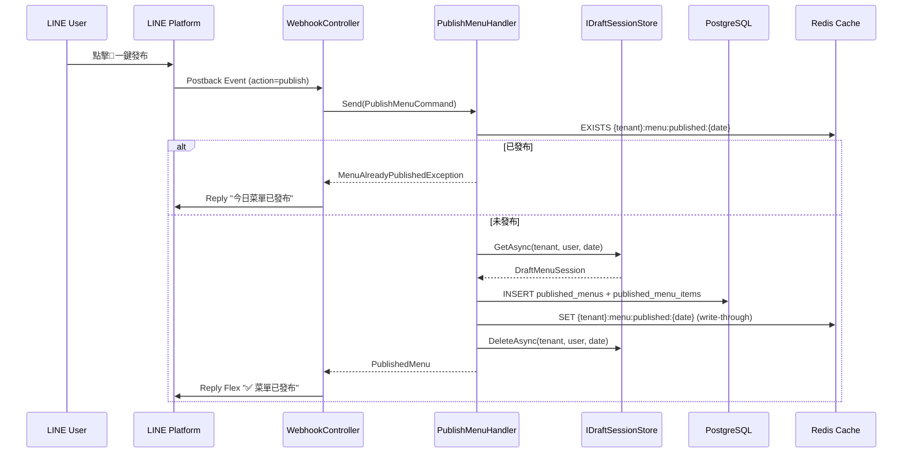
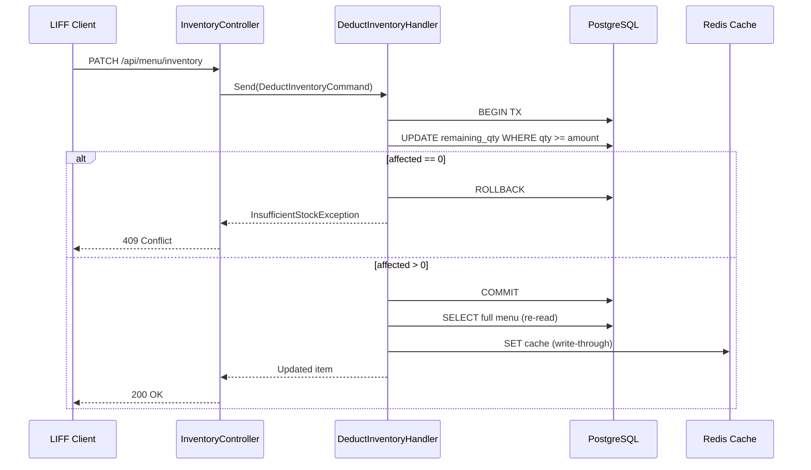
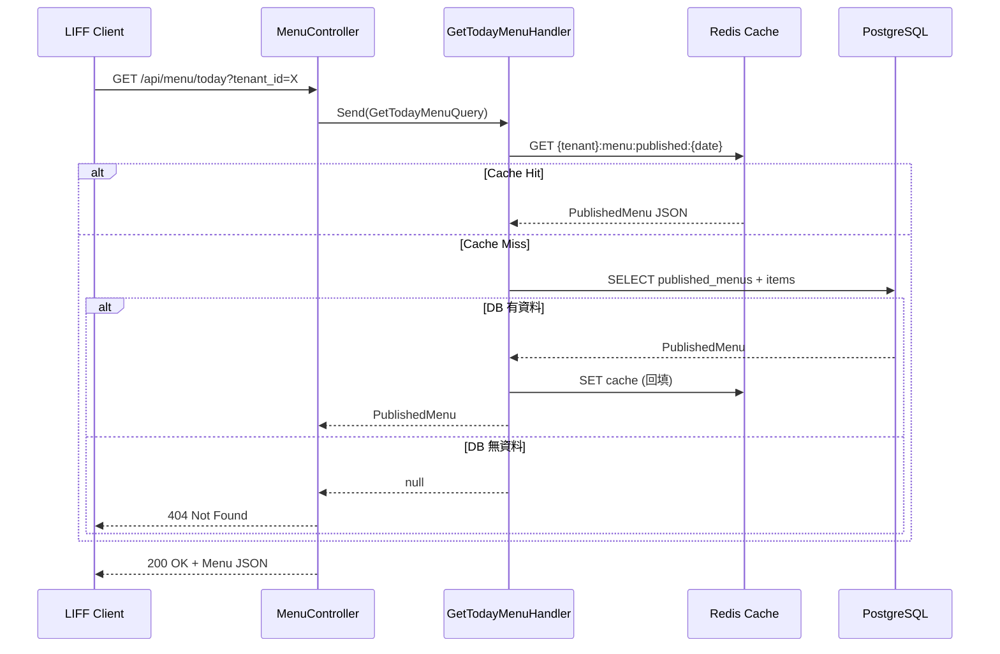

# P3-002: 一鍵發布鎖定 + 今日菜單 API + 庫存扣除 — SA/SD 規格藍圖

## 文件資訊

| 項目 | 值 |
|------|---|
| Phase | 3 |
| 上游輸入 | `docs/菜商神隊友_PRD_v2_開發技術版.md` §3.4, §4 |
| 前置完成 | P3-001（Redis 草稿管理 + 雙軌修正 API） |
| 下游消費者 | 前端 PG（LIFF 今日菜單）、後端 PG（庫存扣除） |
| 狀態 | Draft |

---

## 1. 系統邊界定義

### Scope 內
- 一鍵發布：草稿 → 發布菜單（Redis published key + DB 持久化）
- 發布鎖定：已發布後刪除草稿，自然阻斷修改
- `POST /api/menu/publish`：LINE Postback → 發布
- `DELETE /api/menu/publish`：撤回（MVP 回傳 501）
- `GET /api/menu/today?tenant_id={id}`：今日已發布菜單
- `PATCH /api/menu/inventory`：庫存扣除（PostgreSQL Row-Level Lock）
- Redis write-through 快取已發布菜單
- FlexMessageBuilder 更新：Footer 加 🚀 發布按鈕（Postback Action）
- PostgreSQL schema（published_menus + published_menu_items）
- Dapper + Npgsql 引入

### Scope 外
- LIFF 銷售端前端（P3-003）
- 歷史菜單查詢
- 批次庫存匯入

---

## 2. 架構決策紀錄

### ADR-001: PostgreSQL + Dapper 引入策略

**決策**：引入 Npgsql + Dapper，透過 `IDbConnectionFactory` 抽象管理連線。

**理由**：PRD 規定 Dapper + Repository Pattern + 手寫 SQL。`NpgsqlDataSource` (Npgsql 8+) 作為 DI Singleton，提供連線池。Repository 接受 `NpgsqlDataSource`。

### ADR-002: Published Menu vs Draft 資料模型分離

**決策**：`PublishedMenu` / `PublishedMenuItem` 為獨立 Domain Entity，不複用 `DraftMenuSession`。

**理由**：發布後的菜單有 `remaining_qty`（剩餘庫存）、`published_at` 等草稿不具備的欄位。生命週期也不同：草稿 24h TTL，已發布菜單存 DB 永久保留。

### ADR-003: 發布鎖定機制

**決策**：Redis `EXISTS` check + DB `UNIQUE(tenant_id, date)` 雙重保障。發布成功後刪除草稿。

**理由**：
1. 快速路徑：先 Redis check `{tenant_id}:menu:published:{date}` 是否存在，存在即回 409
2. DB UNIQUE 約束兜底：即使 Redis 故障，DB 層面也保證每天每租戶只能發布一次
3. 刪除草稿：發布後呼叫 `IDraftSessionStore.DeleteAsync`，自然阻斷後續修改

### ADR-004: 庫存扣除併發策略

**決策**：`UPDATE ... WHERE remaining_qty >= @amount` + DB `CHECK(remaining_qty >= 0)` 雙重保障。

**理由**：Row-Level Lock 是 PostgreSQL 預設行為（UPDATE 自動取得 row lock）。`WHERE remaining_qty >= @amount` 是樂觀鎖語義——如果庫存不足，`affected == 0`，拋出 `InsufficientStockException`。`CHECK` 約束作為第二層保險。

### ADR-005: Redis Write-Through 一致性

**決策**：DB commit 後重新讀取整份菜單覆寫 Redis cache。

**理由**：避免部分更新造成不一致。代價是一次額外 SELECT，但菜單通常 < 50 品項，query 極快。

### ADR-006: Flex Message Footer 🚀 按鈕

**決策**：使用 LINE Postback Action，data 欄位帶 `action=publish&tenant_id={id}&user_id={userId}`。

**理由**：Postback 不汙染使用者文字輸入管線（不觸發 LLM 解析），且可攜帶結構化參數。WebhookController 新增 Postback event handler。

### ADR-007: 撤回功能預留

**決策**：定義 `UnpublishMenuCommand` 介面，MVP 實作回傳 501 Not Implemented。

**理由**：完整撤回涉及已扣庫存回滾問題，MVP 不處理。介面預留可在後續 phase 實作。

---

## 3. Sequence Diagrams

### 3.1 發布流程



### 3.2 庫存扣除流程



### 3.3 查詢流程



---

## 4. Domain Model

### 4.1 PublishedMenu

```csharp
namespace VeggieAlly.Domain.Models.Menu;

public sealed class PublishedMenu
{
    public required string Id { get; init; }              // GUID "N" 格式
    public required string TenantId { get; init; }
    public required string PublishedByUserId { get; init; }
    public required DateOnly Date { get; init; }
    public required List<PublishedMenuItem> Items { get; init; }
    public required DateTimeOffset PublishedAt { get; init; }
}
```

### 4.2 PublishedMenuItem

```csharp
namespace VeggieAlly.Domain.Models.Menu;

public sealed class PublishedMenuItem
{
    public required string Id { get; init; }              // GUID "N" 格式
    public required string MenuId { get; init; }
    public required string Name { get; init; }
    public bool IsNew { get; init; }
    public decimal BuyPrice { get; init; }
    public decimal SellPrice { get; init; }
    public int OriginalQty { get; init; }
    public int RemainingQty { get; set; }
    public required string Unit { get; init; }
    public decimal? HistoricalAvgPrice { get; init; }
}
```

### 4.3 Exceptions

```csharp
namespace VeggieAlly.Domain.Exceptions;

public sealed class InsufficientStockException : Exception
{
    public string ItemId { get; }
    public InsufficientStockException(string itemId)
        : base($"庫存不足: {itemId}") => ItemId = itemId;
}

public sealed class MenuAlreadyPublishedException : Exception
{
    public MenuAlreadyPublishedException()
        : base("今日菜單已發布") { }
}

public sealed class MenuNotPublishedException : Exception
{
    public MenuNotPublishedException()
        : base("尚未發布菜單") { }
}
```

---

## 5. Application Layer

### 5.1 Interfaces

```csharp
// IPublishedMenuRepository — Dapper Repository
namespace VeggieAlly.Application.Common.Interfaces;

public interface IPublishedMenuRepository
{
    Task<PublishedMenu?> GetByTenantAndDateAsync(string tenantId, DateOnly date, CancellationToken ct = default);
    Task InsertAsync(PublishedMenu menu, CancellationToken ct = default);
    Task<int> DeductItemStockAsync(string tenantId, string itemId, int amount, CancellationToken ct = default);
    Task DeleteByTenantAndDateAsync(string tenantId, DateOnly date, CancellationToken ct = default);
}
```

```csharp
// IPublishedMenuCache — Redis Cache
namespace VeggieAlly.Application.Common.Interfaces;

public interface IPublishedMenuCache
{
    Task<PublishedMenu?> GetAsync(string tenantId, DateOnly date, CancellationToken ct = default);
    Task SetAsync(PublishedMenu menu, CancellationToken ct = default);
    Task RemoveAsync(string tenantId, DateOnly date, CancellationToken ct = default);
    Task<bool> ExistsAsync(string tenantId, DateOnly date, CancellationToken ct = default);
}
```

### 5.2 Commands & Queries

```csharp
// PublishMenuCommand
public sealed record PublishMenuCommand(
    string TenantId, string LineUserId) : IRequest<PublishedMenu>;

// UnpublishMenuCommand (MVP: 501)
public sealed record UnpublishMenuCommand(
    string TenantId) : IRequest;

// GetTodayMenuQuery
public sealed record GetTodayMenuQuery(
    string TenantId) : IRequest<PublishedMenu?>;

// DeductInventoryCommand
public sealed record DeductInventoryCommand(
    string TenantId, string ItemId, int Amount) : IRequest<PublishedMenuItem>;
```

### 5.3 PublishMenuHandler 邏輯

```
1. cache.ExistsAsync → 已存在 → throw MenuAlreadyPublishedException
2. draftStore.GetAsync → null → throw MenuNotPublishedException (草稿不存在)
3. 將 DraftMenuSession.Items 轉換為 PublishedMenu + PublishedMenuItems
4. repository.InsertAsync (DB persist)
5. cache.SetAsync (Redis write-through)
6. draftStore.DeleteAsync (刪除草稿，鎖定)
7. return PublishedMenu
```

### 5.4 DeductInventoryHandler 邏輯

```
1. repository.DeductItemStockAsync(tenantId, itemId, amount)
2. if affected == 0 → throw InsufficientStockException
3. repository.GetByTenantAndDateAsync → 重新讀取完整菜單
4. cache.SetAsync (write-through 更新)
5. return updated PublishedMenuItem
```

### 5.5 GetTodayMenuHandler 邏輯

```
1. cache.GetAsync → hit → return
2. miss → repository.GetByTenantAndDateAsync
3. found → cache.SetAsync (回填) → return
4. not found → return null
```

---

## 6. Infrastructure Layer

### 6.1 PostgreSQL Schema

```sql
CREATE TABLE IF NOT EXISTS published_menus (
    id              VARCHAR(32)     PRIMARY KEY,
    tenant_id       VARCHAR(64)     NOT NULL,
    published_by    VARCHAR(64)     NOT NULL,
    date            DATE            NOT NULL,
    published_at    TIMESTAMPTZ     NOT NULL DEFAULT NOW(),
    CONSTRAINT uq_published_menus_tenant_date UNIQUE (tenant_id, date)
);

CREATE INDEX idx_published_menus_tenant_date ON published_menus (tenant_id, date);

CREATE TABLE IF NOT EXISTS published_menu_items (
    id                  VARCHAR(32)     PRIMARY KEY,
    menu_id             VARCHAR(32)     NOT NULL REFERENCES published_menus(id) ON DELETE CASCADE,
    tenant_id           VARCHAR(64)     NOT NULL,
    name                VARCHAR(128)    NOT NULL,
    is_new              BOOLEAN         NOT NULL DEFAULT FALSE,
    buy_price           DECIMAL(10,2)   NOT NULL,
    sell_price          DECIMAL(10,2)   NOT NULL,
    original_qty        INT             NOT NULL,
    remaining_qty       INT             NOT NULL,
    unit                VARCHAR(16)     NOT NULL,
    historical_avg_price DECIMAL(10,2),
    CONSTRAINT chk_remaining_qty CHECK (remaining_qty >= 0)
);

CREATE INDEX idx_published_menu_items_menu_id ON published_menu_items (menu_id);
CREATE INDEX idx_published_menu_items_tenant ON published_menu_items (tenant_id);
```

### 6.2 Dapper Repository 核心 SQL

```csharp
// InsertAsync
INSERT INTO published_menus (id, tenant_id, published_by, date, published_at)
VALUES (@Id, @TenantId, @PublishedByUserId, @Date, @PublishedAt);

INSERT INTO published_menu_items (id, menu_id, tenant_id, name, is_new, buy_price, sell_price, original_qty, remaining_qty, unit, historical_avg_price)
VALUES (@Id, @MenuId, @TenantId, @Name, @IsNew, @BuyPrice, @SellPrice, @OriginalQty, @RemainingQty, @Unit, @HistoricalAvgPrice);

// GetByTenantAndDateAsync
SELECT * FROM published_menus WHERE tenant_id = @TenantId AND date = @Date;
SELECT * FROM published_menu_items WHERE menu_id = @MenuId AND tenant_id = @TenantId;

// DeductItemStockAsync
UPDATE published_menu_items
SET remaining_qty = remaining_qty - @Amount
WHERE id = @ItemId AND tenant_id = @TenantId AND remaining_qty >= @Amount;

// DeleteByTenantAndDateAsync
DELETE FROM published_menus WHERE tenant_id = @TenantId AND date = @Date;
```

### 6.3 Redis Published Menu Cache

- Key: `{tenantId}:menu:published:{yyyy-MM-dd}`
- TTL: 計算至當日 23:59:59 (台灣時間) 剩餘秒數
- 序列化: JSON (`JsonNamingPolicy.SnakeCaseLower`)

### 6.4 NuGet 新增

```xml
<PackageReference Include="Npgsql" Version="9.0.*" />
<PackageReference Include="Dapper" Version="2.1.*" />
```

---

## 7. WebAPI Layer

### 7.1 MenuController

```
[ApiController]
[Route("api/menu")]

POST   /api/menu/publish       [LiffAuth] → PublishMenuCommand → 201 / 409
DELETE /api/menu/publish       [LiffAuth] → UnpublishMenuCommand → 501 (MVP)
GET    /api/menu/today         ?tenant_id={id} → GetTodayMenuQuery → 200 / 404
```

### 7.2 InventoryController

```
[ApiController]
[Route("api/menu")]

PATCH  /api/menu/inventory     [LiffAuth] → DeductInventoryCommand → 200 / 409 / 400
```

### 7.3 DTO 定義

```csharp
// PublishedMenuDto (GET response)
{
    "id": "...",
    "tenant_id": "...",
    "date": "2026-04-04",
    "published_at": "...",
    "items": [
        {
            "id": "...",
            "name": "初秋高麗菜",
            "is_new": false,
            "sell_price": 35.00,
            "original_qty": 50,
            "remaining_qty": 48,
            "unit": "箱"
        }
    ]
}

// DeductInventoryRequest (PATCH body)
{
    "item_id": "...",
    "amount": 2
}
```

---

## 8. 整合點（與 P3-001）

### 8.1 發布時讀取草稿
- `PublishMenuHandler` 呼叫 `IDraftSessionStore.GetAsync` 取得 `DraftMenuSession`
- 將 `DraftItem[]` 轉換為 `PublishedMenuItem[]`（`Quantity` → `OriginalQty` = `RemainingQty`）

### 8.2 發布後刪除草稿
- `PublishMenuHandler` 呼叫 `IDraftSessionStore.DeleteAsync` 刪除草稿
- 自然阻斷後續 PATCH /api/draft/item/{id} 修改

### 8.3 FlexMessageBuilder 更新
- `BuildDraftBubble` 的 Footer 改為：
  - 有異常品項 → 只顯示 "💡 點擊修正按鈕或重新傳送語音修正"
  - 全部 Ok → 顯示 🚀 一鍵發布 Postback 按鈕
- 新增 `BuildPublishedBubble(PublishedMenu)` — 發布確認卡片

### 8.4 Webhook Postback 處理
- PostbackEvent handler 解析 `data=action=publish&tenant_id=X&user_id=Y`
- 路由到 `PublishMenuCommand`

---

## 9. 安全設計

| # | OWASP | 對策 |
|---|-------|------|
| 1 | A01 Broken Access Control | Tenant 隔離：所有 SQL 帶 tenant_id；Redis key 含 tenant prefix |
| 2 | A01 | 發布/庫存端點需 LiffAuth 驗證 |
| 3 | A03 Injection | Dapper 參數化查詢，禁止字串拼接 SQL |
| 4 | A04 Insecure Design | 庫存 CHECK 約束 + WHERE 條件雙重防超賣 |
| 5 | A05 Security Misconfiguration | DB 連線字串從環境變數讀取，不硬編碼 |
| 6 | A08 Data Integrity | DB UNIQUE 約束防重複發布 |
| 7 | A10 SSRF | 無外部 URL 拉取 |

---

## 10. 單元測試清單

### 10.1 PublishMenuHandlerTests（10 案例）

| # | 測試 | 預期 |
|---|------|------|
| 1 | `Publish_NoDraft_ThrowsMenuNotPublished` | exception |
| 2 | `Publish_AlreadyPublished_ThrowsAlreadyPublished` | exception |
| 3 | `Publish_Valid_InsertsDbAndCache` | DB + Redis called |
| 4 | `Publish_Valid_DeletesDraft` | DeleteAsync called |
| 5 | `Publish_Valid_ReturnsPublishedMenu` | correct mapping |
| 6 | `Publish_ItemsMapping_QuantityToOriginalAndRemaining` | OriginalQty == RemainingQty == DraftItem.Quantity |
| 7 | `Publish_SetsPublisherId` | PublishedByUserId == lineUserId |
| 8 | `Publish_DbFails_DoesNotDeleteDraft` | exception, draft preserved |
| 9 | `Publish_CacheFails_StillSucceeds` | DB persisted, cache degraded |
| 10 | `Publish_EmptyDraft_ThrowsInvalidOp` | exception for 0 items |

### 10.2 GetTodayMenuHandlerTests（5 案例）

| # | 測試 | 預期 |
|---|------|------|
| 1 | `Get_CacheHit_ReturnsFromCache` | cache called, DB not called |
| 2 | `Get_CacheMiss_DbHit_ReturnAndBackfill` | DB called, cache.SetAsync called |
| 3 | `Get_CacheMissDbMiss_ReturnsNull` | null |
| 4 | `Get_CacheThrows_FallsBackToDb` | DB called |
| 5 | `Get_CorrectTenantIsolation` | only own tenant data |

### 10.3 DeductInventoryHandlerTests（7 案例）

| # | 測試 | 預期 |
|---|------|------|
| 1 | `Deduct_Valid_UpdatesDb` | DeductItemStockAsync called |
| 2 | `Deduct_Valid_UpdatesCache` | cache.SetAsync called |
| 3 | `Deduct_InsufficientStock_Throws` | InsufficientStockException |
| 4 | `Deduct_ZeroAmount_ThrowsValidation` | ArgumentException |
| 5 | `Deduct_NegativeAmount_ThrowsValidation` | ArgumentException |
| 6 | `Deduct_CacheFails_StillSucceeds` | DB updated |
| 7 | `Deduct_ReturnsUpdatedItem` | correct remaining qty |

### 10.4 UnpublishMenuHandlerTests（1 案例）

| # | 測試 | 預期 |
|---|------|------|
| 1 | `Unpublish_ThrowsNotImplemented` | NotImplementedException |

### 10.5 MenuControllerTests（8 案例）

| # | 測試 | 預期 |
|---|------|------|
| 1 | `Publish_Valid_Returns201` | 201 Created |
| 2 | `Publish_AlreadyPublished_Returns409` | 409 Conflict |
| 3 | `Publish_NoDraft_Returns404` | 404 |
| 4 | `GetToday_Exists_Returns200` | 200 + body |
| 5 | `GetToday_NotExists_Returns404` | 404 |
| 6 | `GetToday_EmptyTenantId_Returns400` | 400 |
| 7 | `Unpublish_Returns501` | 501 |
| 8 | `Inventory_Valid_Returns200` | 200 |

### 10.6 InventoryControllerTests（5 案例）

| # | 測試 | 預期 |
|---|------|------|
| 1 | `Deduct_Valid_Returns200` | 200 + updated item |
| 2 | `Deduct_InsufficientStock_Returns409` | 409 |
| 3 | `Deduct_ZeroAmount_Returns400` | 400 |
| 4 | `Deduct_NegativeAmount_Returns400` | 400 |
| 5 | `Deduct_MissingItemId_Returns400` | 400 |

### 10.7 PublishedMenuRepositoryTests（6 案例）

| # | 測試 | 預期 |
|---|------|------|
| 1 | `Insert_ThenGet_ReturnsSame` | round-trip |
| 2 | `Get_NonExistent_ReturnsNull` | null |
| 3 | `Deduct_Sufficient_ReturnsAffected` | affected == 1 |
| 4 | `Deduct_InsufficientQty_Returns0` | affected == 0 |
| 5 | `Delete_ThenGet_ReturnsNull` | null |
| 6 | `Insert_Duplicate_ThrowsUniqueViolation` | exception |

### 10.8 PublishedMenuCacheTests（5 案例）

| # | 測試 | 預期 |
|---|------|------|
| 1 | `Set_ThenGet_ReturnsSame` | round-trip |
| 2 | `Get_NonExistent_ReturnsNull` | null |
| 3 | `Exists_AfterSet_ReturnsTrue` | true |
| 4 | `Exists_BeforeSet_ReturnsFalse` | false |
| 5 | `Remove_ThenExists_ReturnsFalse` | false |

### 10.9 FlexMessageBuilder 擴充（3 案例）

| # | 測試 | 預期 |
|---|------|------|
| 1 | `BuildDraftBubble_AllOk_HasPublishButton` | Footer 含 🚀 Postback |
| 2 | `BuildDraftBubble_HasAnomaly_NoPublishButton` | Footer 無按鈕 |
| 3 | `BuildPublishedBubble_ShowsConfirmation` | 含 ✅ 確認訊息 |

### 10.10 WebhookController Postback 擴充（3 案例）

| # | 測試 | 預期 |
|---|------|------|
| 1 | `Receive_PostbackPublish_DispatchesCommand` | PublishMenuCommand sent |
| 2 | `Receive_PostbackUnknown_Skips` | no dispatch |
| 3 | `Receive_PostbackHandlerThrows_Returns200` | 200 (LINE 需要) |

**總計**：新增 ~53 個測試案例 + 修改既有測試。

---

## 11. 檔案清單

### 新增

| # | 路徑 | 說明 |
|---|------|------|
| 1 | `src/VeggieAlly.Domain/Models/Menu/PublishedMenu.cs` | Domain entity |
| 2 | `src/VeggieAlly.Domain/Models/Menu/PublishedMenuItem.cs` | Domain entity |
| 3 | `src/VeggieAlly.Domain/Exceptions/InsufficientStockException.cs` | Domain exception |
| 4 | `src/VeggieAlly.Domain/Exceptions/MenuAlreadyPublishedException.cs` | Domain exception |
| 5 | `src/VeggieAlly.Domain/Exceptions/MenuNotPublishedException.cs` | Domain exception |
| 6 | `src/VeggieAlly.Application/Common/Interfaces/IPublishedMenuRepository.cs` | Dapper repo interface |
| 7 | `src/VeggieAlly.Application/Common/Interfaces/IPublishedMenuCache.cs` | Redis cache interface |
| 8 | `src/VeggieAlly.Application/Menu/Publish/PublishMenuCommand.cs` | Command |
| 9 | `src/VeggieAlly.Application/Menu/Publish/PublishMenuHandler.cs` | Handler |
| 10 | `src/VeggieAlly.Application/Menu/Unpublish/UnpublishMenuCommand.cs` | Command (501) |
| 11 | `src/VeggieAlly.Application/Menu/Unpublish/UnpublishMenuHandler.cs` | Handler (501) |
| 12 | `src/VeggieAlly.Application/Menu/GetToday/GetTodayMenuQuery.cs` | Query |
| 13 | `src/VeggieAlly.Application/Menu/GetToday/GetTodayMenuHandler.cs` | Handler |
| 14 | `src/VeggieAlly.Application/Menu/DeductInventory/DeductInventoryCommand.cs` | Command |
| 15 | `src/VeggieAlly.Application/Menu/DeductInventory/DeductInventoryHandler.cs` | Handler |
| 16 | `src/VeggieAlly.Infrastructure/Persistence/PublishedMenuRepository.cs` | Dapper impl |
| 17 | `src/VeggieAlly.Infrastructure/Cache/PublishedMenuCache.cs` | Redis cache impl |
| 18 | `src/VeggieAlly.WebAPI/Controllers/MenuController.cs` | API controller |
| 19 | `src/VeggieAlly.WebAPI/Controllers/InventoryController.cs` | API controller |
| 20 | `db/migrations/001_create_published_menus.sql` | DDL script |

### 修改

| # | 路徑 | 說明 |
|---|------|------|
| 1 | `src/VeggieAlly.Infrastructure/DependencyInjection.cs` | +Repository +Cache +Npgsql DI |
| 2 | `src/VeggieAlly.Infrastructure/VeggieAlly.Infrastructure.csproj` | +Npgsql +Dapper |
| 3 | `src/VeggieAlly.Application/Services/FlexMessageBuilder.cs` | +BuildPublishedBubble +Footer 🚀按鈕 |
| 4 | `src/VeggieAlly.Application/Common/Interfaces/IFlexMessageBuilder.cs` | +BuildPublishedBubble |
| 5 | `src/VeggieAlly.WebAPI/Controllers/WebhookController.cs` | +Postback handler |
| 6 | `src/VeggieAlly.WebAPI/appsettings.json` | +PostgreSQL ConnectionString |
| 7 | `src/VeggieAlly.WebAPI/Program.cs` | +NpgsqlDataSource +new services |
| 8 | `docker-compose.yml` | +postgres service |
